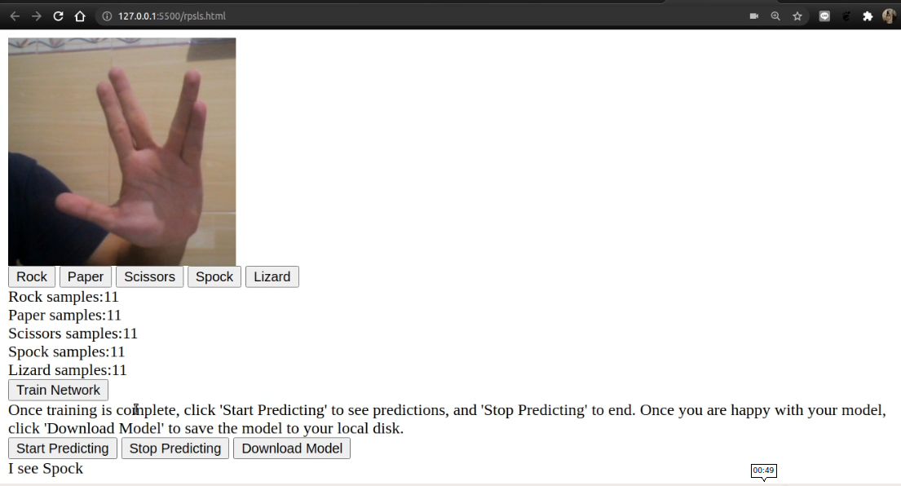

# MNIST with Tensorflow.js

Kode ini merupakan tugas Coursera pada course [Browser-based Models with TensorFlow.js](https://www.coursera.org/learn/browser-based-models-tensorflow/home/welcome).

## HOW TO

- *Sebaiknya fork dulu projek ini*

- Kemudian download projek dengan cara clone / download zip

- Buka folder projek di komputer lokal

- Jalankan dengan [live server](https://marketplace.visualstudio.com/items?itemName=ritwickdey.LiveServer) pada vs code atau [Web Server for Chrome](https://chrome.google.com/webstore/detail/web-server-for-chrome/ofhbbkphhbklhfoeikjpcbhemlocgigb)

- Bentuk tangan di depan kamera sesuai kelas yang ada dan klik kelas yang sesuai untuk menyimpan sampel foto yang akan di training

- Setelah sampel diambil (lebih banyak sampel lebih baik), lakukan training dengan klik `train network`.

- Setelah proses training selesai, silahkan `start predicting` untuk memprediksi bentuk tangan apa yang terlihat di kamera. `stop predicting` untuk menghentikan prediksi.

